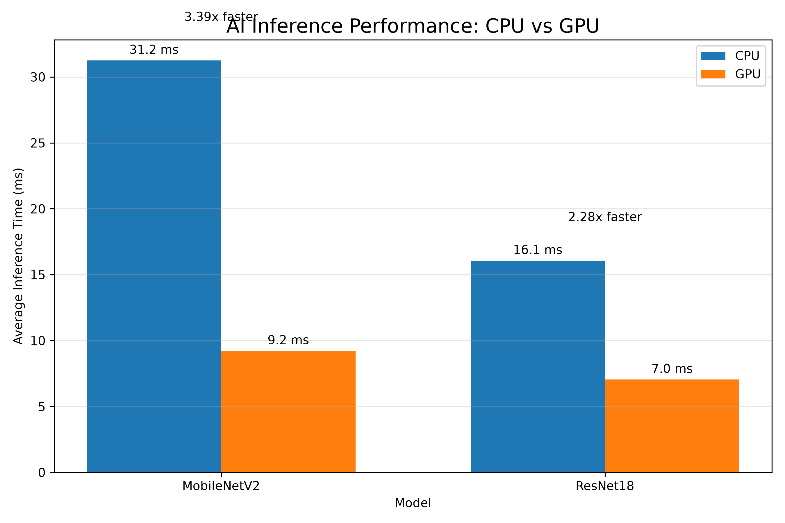

# AI Inference Benchmark

A small Python project I built to explore how AI image classification models perform on different hardware.

The program compares the inference speed of **MobileNetV2** and **ResNet18** using both the **CPU** and **Apple GPU (MPS)** on my Mac.

## What the Project Does

The user can select any image from their computer.

The program then:

1. Loads the image and prepares it for the AI model.
2. Runs the image through MobileNetV2 and ResNet18.
3. Displays the model's predicted image class and confidence.
4. Runs each model 100 times.
5. Calculates the average inference time.
6. Compares CPU and Apple GPU performance.
7. Calculates the GPU speed-up.
8. Generates a graph showing the benchmark results.

## Example Benchmark Results

One test produced approximately:

| Model | CPU | Apple GPU | GPU Speed-up |
|---|---:|---:|---:|
| MobileNetV2 | 29.35 ms | 9.02 ms | 3.25x |
| ResNet18 | 15.90 ms | 6.93 ms | 2.29x |

In this test, **ResNet18 running on the Apple GPU was the fastest combination**.

> Results will vary depending on the computer, image and system conditions.

## Benchmark Graph



## Technologies Used

- Python
- PyTorch
- TorchVision
- Apple Metal Performance Shaders (MPS)
- Matplotlib
- Pillow
- Tkinter

## Models

### MobileNetV2

MobileNetV2 is designed to be a relatively lightweight image classification model.

In my tests it had approximately **3.5 million parameters**.

### ResNet18

ResNet18 is a larger image classification model with approximately **11.7 million parameters**.

Interestingly, despite having more parameters, ResNet18 ran faster than MobileNetV2 on my machine.

This showed me that model size alone does not determine real-world inference performance.

## CPU vs GPU

PyTorch normally runs models on the CPU unless another device is selected.

For Apple Silicon, PyTorch can use the Apple GPU through the **MPS (Metal Performance Shaders)** backend.

This project runs the same models on both devices:

```python
device = torch.device("cpu")
```

and:

```python
device = torch.device("mps")
```

This allows the performance difference to be measured while keeping the model and input the same.

## What I Learned

I built this project because I wanted to understand AI inference and hardware acceleration beyond simply reading about them.

Through the project I learned about:

- AI training vs inference
- using pretrained neural networks
- image preprocessing
- tensors
- model parameters
- converting model outputs into probabilities
- benchmarking inference latency
- CPU vs GPU execution
- GPU synchronisation when measuring performance
- why repeated measurements are more useful than a single timing result
- why model size does not always directly predict execution speed

One of the most interesting results was seeing how much faster both models ran on the GPU compared with the CPU.

This helped me better understand why specialised hardware such as GPUs and NPUs can be useful for AI workloads.

## Important Note

I did **not train MobileNetV2 or ResNet18 myself**.

The project uses pretrained models provided through TorchVision. My focus was on building an inference and benchmarking tool around these models and investigating their performance on different hardware.

## Running the Project

### 1. Clone the repository

```bash
git clone https://github.com/katyyang0413/ai-inference-benchmark.git
```

### 2. Enter the project

```bash
cd ai-inference-benchmark
```

### 3. Create a virtual environment

```bash
python3 -m venv .venv
```

### 4. Activate it

On macOS/Linux:

```bash
source .venv/bin/activate
```

### 5. Install dependencies

```bash
pip install torch torchvision pillow matplotlib
```

### 6. Run

```bash
python main.py
```

A file picker will appear allowing you to choose an image from your computer.

## Future Improvements

Some areas I would like to explore further include:

- benchmarking additional AI models
- testing different image sizes
- comparing throughput as well as latency
- measuring memory usage
- testing larger workloads and batch sizes
- exploring model optimisation and quantisation
- comparing performance across CPU, GPU and dedicated AI accelerators
